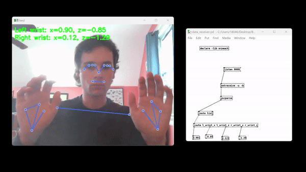
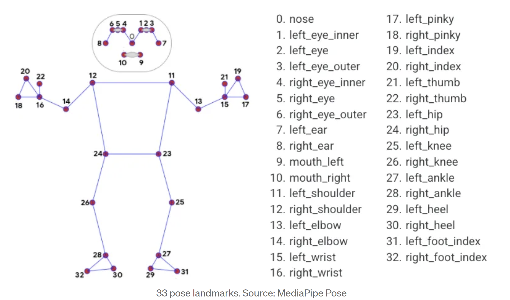

Oscar Muendel & Henry Bryant

## Description

Python project using open-cv & media-pipe for body detection. Sending
data through OSC using python-osc To be used along side pure-data for
sound exhibition.

## Mediapipe & Pose Detection

"The MediaPipe Pose Landmarker task lets you detect landmarks of human bodies in an image or video. You can use this task to identify key body locations, analyze posture, and categorize movements. This task uses machine learning (ML) models that work with single images or video. The task outputs body pose landmarks in image coordinates and in 3-dimensional world coordinates."
[Media Pipe Documentation] (https://ai.google.dev/edge/mediapipe/solutions/vision/pose_landmarker)

## Controls

T - Toggle the Landmarks
V - Toggle the Video Feed

## Installation

python -m venv venv

./venv/Scripts/activate

pip install -r requirements.txt

## Known Issues

mediapipe==0.10.10 is not compatible with Mac M1. Please downgrade to mediapipe==0.10.9 for Mac users.

mediapipe==0.10.09 is not compatible with Windoww. Please upgrade to meidapipe==0.10.10 for Windows. 

The default camera on mac is index 1 and on windows it is 0. If you are getting unexpected errors, check which camera you are using.